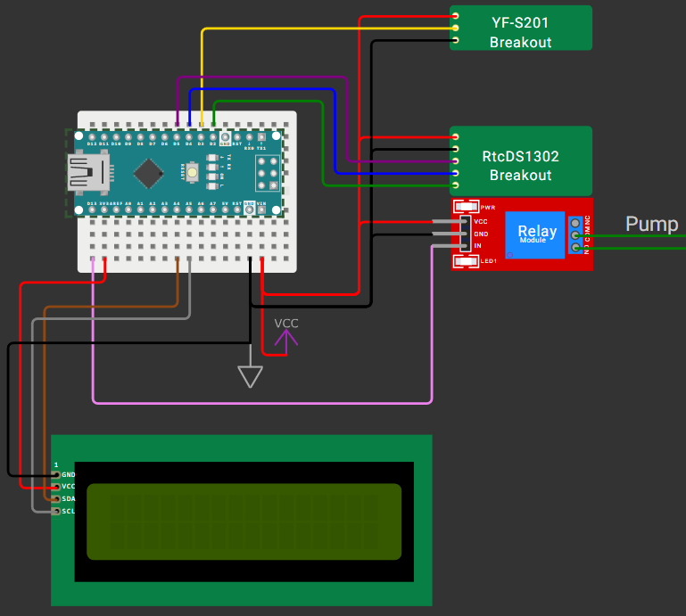
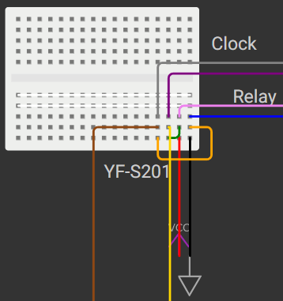

# flowAutomatic 
Скетч для автоматизации работы **котла с ГВС** / *бойлера* с внешним рециркуляционным насосом. Актуально для котлов с **трёхходовым клапаном** и **вторичным теплообменником ГВС**. Имеется защита от сухого хода (поток ниже допустимого).
## Компоненты (в скобках те, которые использовал я) и библиотеки
- Arduino (*Nano*)
- Макетная плата (*17x10 без шин питания*)
- Релейный модуль (*CW-019* с реле *SRD-05VDC-SL-C* на **10A 252VAC**) - включение насоса.
- [Расходомер](https://github.com/hafidhh/FlowSensor-Arduino) (*YF-S201*) - в качестве датчика потока. Ставится сразу после выхода из котла/бойлера.
- [Часы реального времени](https://github.com/Makuna/Rtc) (*DS1302*) - часы. Можно использовать *DS1307* (настройка ***CLOCK_TYPE***). При необходимости часы сами настроятся при первом запуске (запишется время компиляции скетча).
- [Дисплей](https://github.com/locple/LCDI2C_Multilingual) (*LCD1602A-I2C*) - дисплей. Если у вас не работают русские буквы (за место них японские или ещё что), то включите ***LCD_FIX_CYRILLIC*** в настройках, подтянется **rusLCD_Custom.h** (идёт в комплекте). Также есть скрипт на Python для рисовки кастомных символов.
## Схема сборки
Общая схема сборки компонентов (В **Wokwi** нет часов *DS1302* и *расходомеров*, поэтому они вставлены как кастомные чипы)

Схема распиновки питания в условиях ограниченного пространства (дисплей питается от 3V3, т.к. четвёртый ряд недоступен из-за размеров микрокомпьютера и не хватило места)

Настройки описаны в самом скетче.

### Рекомендации
- Подключать питание не через USB, а на **VIN(+5V)** и **GND** т.к. после USB может быть не **5V**, а **4.7V**.
- Рециркуляционные насосы обычно имеют несколько скоростей, поэтому сначала проверьте поток и скорректируйте настройку ***FLOW_WORK***.
- Подключите свою сборку к насосу и расходомеру на пару часов и не открывайте краны. Если после этого при открытии крана вода недостаточно тёплая, то уменьшите время ожидания ***TIME_IDLE*** и/или увеличьте время прогрева ***TIME_WARM*** и повторите проверку.

